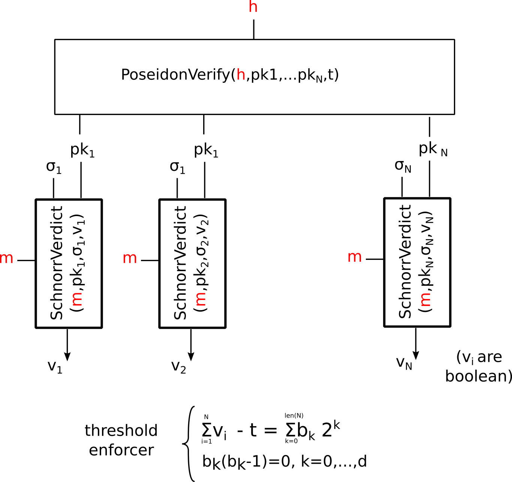
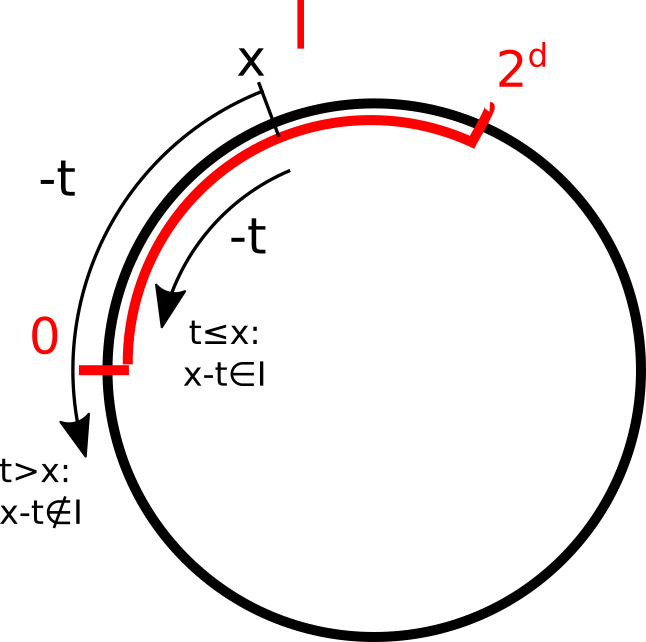

# Generic Threshold Circuit for Schnorr Signatures

We describe a generic counting and threshold comparison procedure for Schnorr signatures (as in [ginger-lib's SchnorrSignature.pdf](https://github.com/HorizenOfficial/ginger-lib/blob/development/doc/SchnorrSignature.pdf)) formulated as circuit over the 'SNARK field' $F$ with modulus bit length denoted by $len|F|$. As a fixed circuit it should be able to treat up to
$$N < L=len|F|,$$
public keys,
$$pk_1,pk_2,\ldots, pk_N,$$
arranged in a linearly ordered list, with *Null keys* $pk_{NULL}$ to fill up to the maximum number $N$, if there a less signer. 

#### Normative notes

For our purpose, we assume  $pk_{NULL} \in \mathbb G$ to be a *phantom key*, i.e. an arbitrary fixed element from the group $\mathbb G= MNT4-753=EC(F)$  (as used by the signature scheme) to which nobody knows the secret key. A simple way to do this in a publicly verifiable manner is by choosing it as hash of some public data, for example
$$pk_{NULL} = H(\text{"magic string")},$$
where $H$ is any hash-to-curve algorithm and some publicly declared "magic string" (e.g. $\text{"Strontium Sr 90"}$). 

Notice that the upper bound for  $N$ is quite arbitrarily chosen to satisfy
$$d = len(N) < len|F|-1,$$
as needed for the threshold enforcer described below, and not too large anyway for performance. However, any other $N$ the bit length of which satisfies the above inequality is fine. 

## The Generic Threshold Gadget

Our gadget $Threshold(m,h)$ is as follows.

- Public input: 
  - message $m$ (as single element from $F$), 
  - $h\in F$, the POSEIDON Hash as commitment on the parameters of the threshold scheme (in our case the threshold $t\in F$ ), and the public keys $pk_1,pk_2,\ldots, pk_{N}$ allowed to sign (including null keys).
- Private input / witnesses:
  - the threshold $t\in F$, 
  - the public keys $pk_1,\ldots, pk_{N}$ (including possible null keys) in the same order as done for the computation of $h$,
  - Schnorr signatures $\sigma_1,\ldots,\sigma_{N}$, including arbitrarily chosen null signatures $\sigma_{NULL}$ (e.g., $\sigma_{NULL}=\left( 1,1\right) $) to fill up to full length,
  - Boolean variables $b_0,\ldots,b_{d-1}$ for the threshold comparison.

It's circuit is based on three components, as depicted below: 

1. *Poseidon* Gadget, which enforces the privatly chosen $pk_i$ to hash to the given fingerprint $h$, 
2. the $SchnorrVerdict$ gadget, as described in [ginger-lib's SchnorrVerdict.pdf](https://github.com/HorizenOfficial/ginger-lib/blob/development/doc/SchnorrVerdict.pdf), which enforces the Boolean verdicts $v_i$ to reflect a valid/invalid signature, and 
3. the *threshold enforcer*, which uses a simple length-restriction argument to force that the number $v=\sum_{i=1}^{N} v_i$ of valid signatures satisfies $v\geq t$ .



### The Poseidon gadget

is as described in [ginger-lib's Poseidon.pdf](https://github.com/HorizenOfficial/ginger-lib/blob/development/doc/Poseidon.pdf), extended to the domain of $N$ field elements (the public keys to be hashed).

### Threshold enforcer

To guarantee that two integers $x$, $t$ from $I=\left[0,2^d-1\right]$ as subset of $F$ satisfy  $x\geq t$, we take $x-t$ in $F$ and force it to be in the same interval $I$ simply by demanding an at most $d$ bit integer representation
```math
\begin{align*} x &= \sum_{k=0}^{d-1}b_k \cdot 2^k \\ 0 &= b_k \cdot (b_k-1), &k=0, \ldots ,d-1\end{align*}
```
Note that $d$ needs to be smaller than the length $L$ of the field modulus (In practice it is much smaller, e.g. $d=4$), so that $2^{d+1}< |F|$.



Notice that this gadget comes almost for free, demanding only $d+1$ rank one constraints.

Comment, or why it works although risking modular reduction at any point during the calculation: any integer solution $(b_i)$ of   
```math
\begin{align*} x &= b_0+b_1 \cdot 2 + \dots + b_d\cdot 2^{d-1} \bmod r,\\ 0 &= b_i \cdot (1-b_i) \bmod r, &i=0,\ldots,d-1 \end{align*}
```
is forced by the Boolean constraints $0=b_i\cdot(1-b_i)$ to be of the form 
$$b_i = \epsilon_i + k\cdot r, \quad \epsilon_i\in\{0,1\},$$
where $k\cdot r$ is a (positive or negative) multiple of the modulus $r$. Hence, by the first equation, $x$ and 
$$\sum_{i=0}^{d-1} \epsilon_i\cdot 2^i$$

can still only differ by a multiple of $r$. But this means that $x$ has a representation (mod $r$) as an integer from $I$. 


